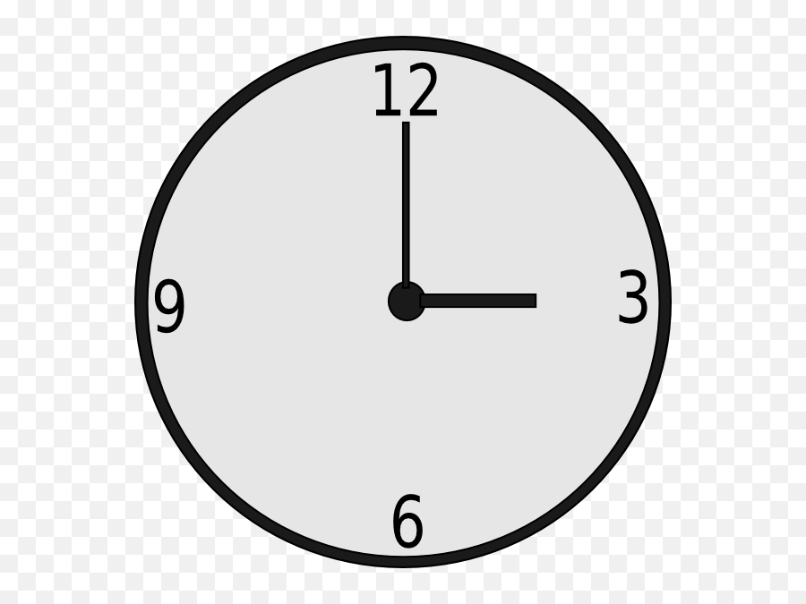

# Coding Challenge: Angle Between Hands of an Analog Clock

## Problem Statement

Given two numbers representing the hour and minutes of a clock, write a function that returns the smaller angle (in degrees) formed between the hour and minute hands.

## Input

- An integer `hours` in the range `[0, 12]`.
- An integer `minutes` in the range `[0, 59]`.

## Output

- A floating-point number representing the smaller angle in degrees.

## Example

If the time is `3:00`, the angle between the hour and minute hands is `90` degrees.
If the time is `8:15`, the angle between the hour and minute hands is approximately `157.5` degrees.

## Notes

- Assume the hour and minute hands move smoothly and instantaneously.
- The returned angle should be within the range `[0, 180]` degrees.

## Hints

- Consider the positions of the hands relative to a fixed point on the clock face.
- The hour hand completes a full rotation every 12 hours, while the minute hand completes a full rotation every 60 minutes.
- You need to calculate the current positions of both hands and find the absolute difference between them.
- Remember to normalize the result to be within the range `[0, 180]` degrees.

## Constraints

- The function must run in constant time complexity.
- The function must return the exact angle as a floating-point number.

## Evaluation

Your submission will be evaluated based on correctness and efficiency. Ensure that your solution handles edge cases correctly and runs in linear time.

Good luck!
